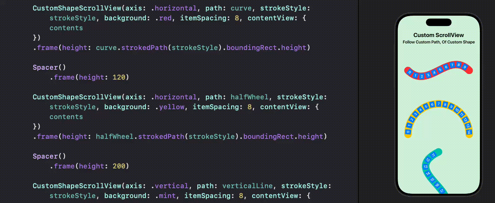

# ScrollView with Custom Shape 

Scrollview Follow Custom Path, Of Custom Shape, 
with subviews following the path tangent.

This can be used to create circular wheel picker, sinusoid scrollview, and etc.

Both horizontal and vertical scrollview supported.

For more details, please refer to my article: [SwiftUI: ScrollView Follow Custom Path, Of Custom Shape](https://medium.com/@itsuki.enjoy/swiftui-scrollview-follow-custom-path-of-custom-shape-b65bb6cb9e5c)

